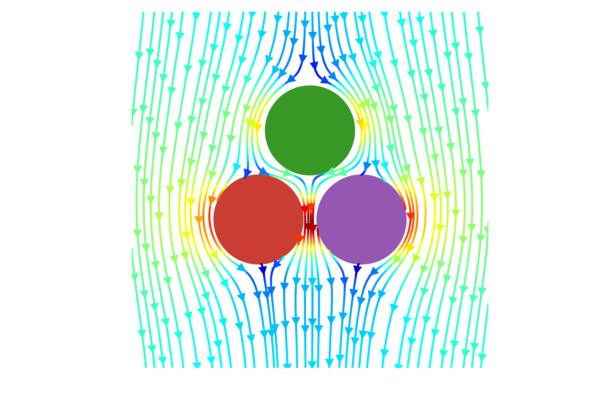
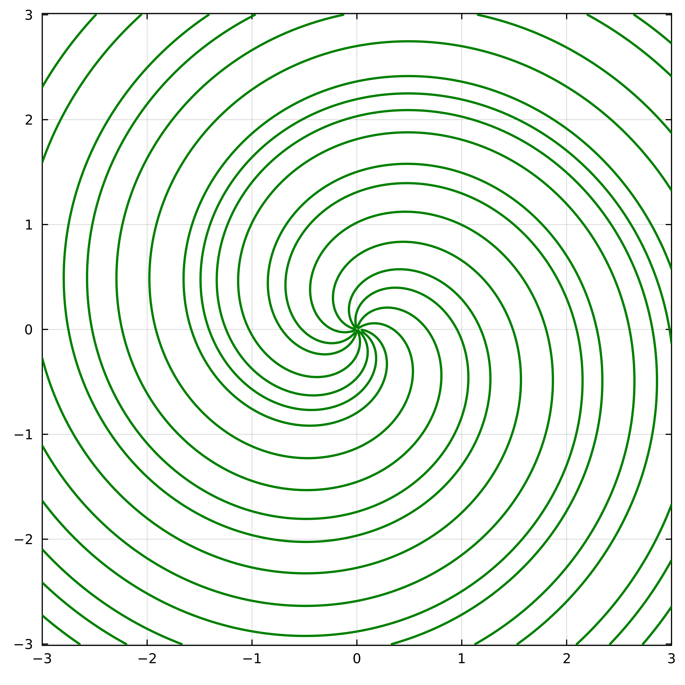
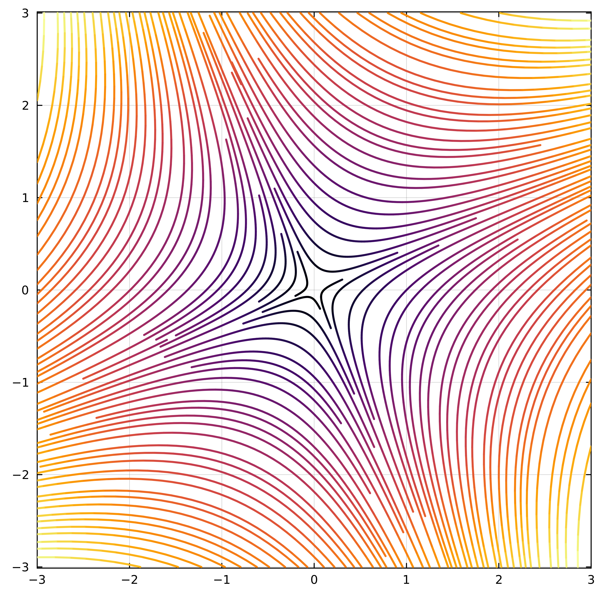
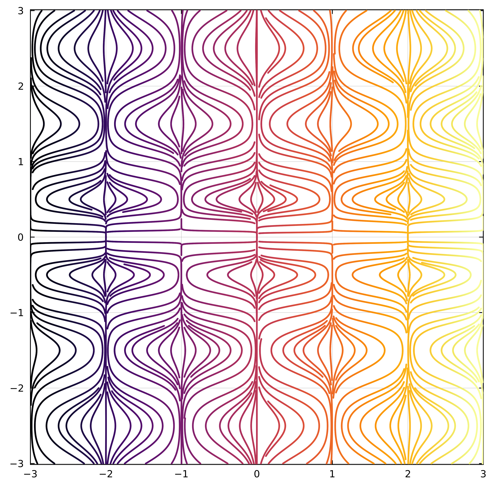
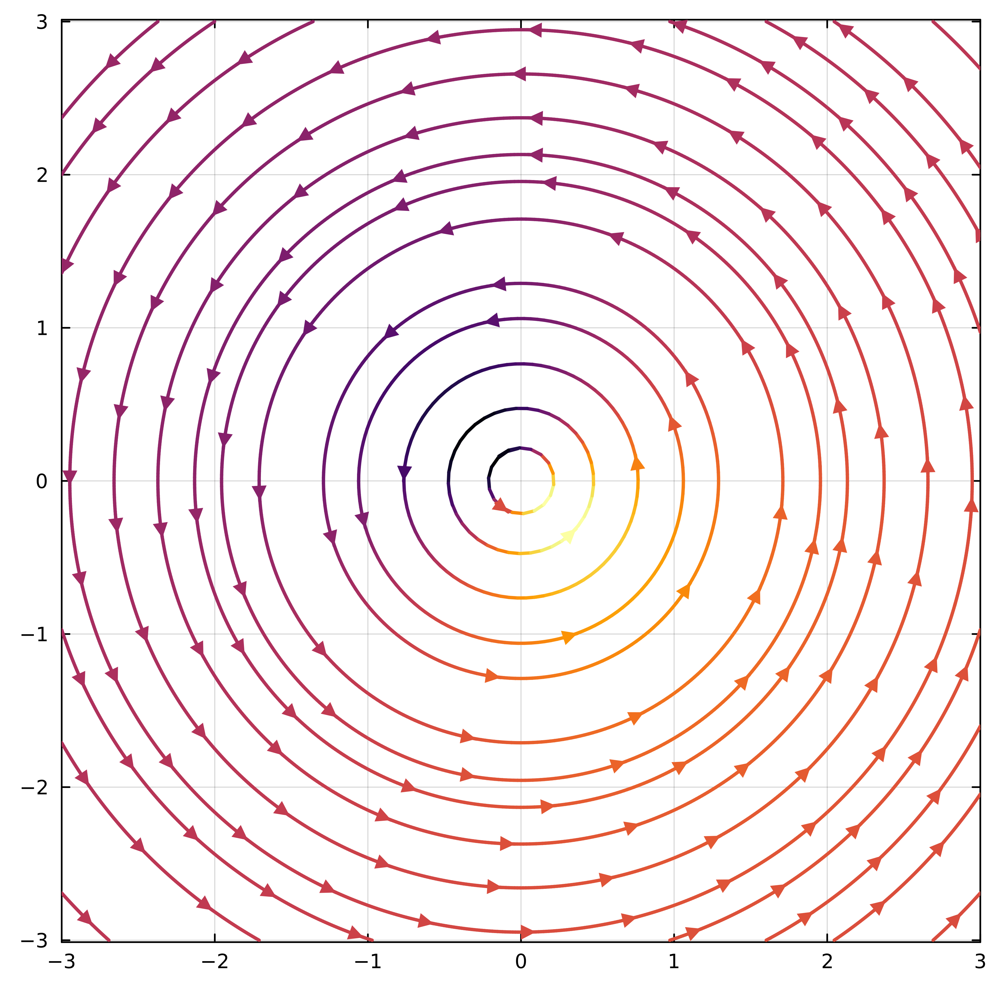
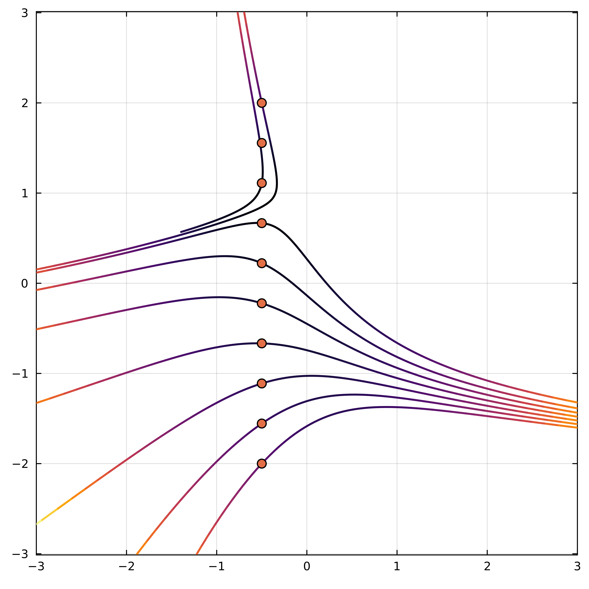

<h2 align="center">PrettyStreamlines.jl</h2>
<p align="center">
  
</p>

An extension to the Plots.jl ecosystem providing evenly‑spaced streamline plots of arbitrary density. Under the hood it implements the classic Jobard–Lefer algorithm.

---

### Features

- **Grid‑based fields**: supply `u` and `v` as $N_y \times N_x$ matrices on a mesh.
- **Functional fields**: supply `u(x,y)` and `v(x,y)` as functions; these will be sampled automatically on your mesh.
- Configurable **minimum** and **maximum** streamline density.
- Optionally draw **unbroken** streamlines (no collision‐based truncation).
- Specify **seed points** manually or let the algorithm auto‑place them.
- Support for **color mapping** by magnitude or arbitrary functions.
- **Glyphs** (arrows) along each streamline with controllable spacing and scale.
- Support for **masking** of vector fields

---

### Installation
The package is not currenlty registered and can be installed from this repisotory as
```julia
using Pkg
Pkg.add("https://github.com/antoniosgeme/PrettyStreamlines.jl.git")
```

### Quickstart
The primary user‑facing function is a recipe for streamlines, used like any other Plots.jl series, and exposed the following additional keyword arguments:
```julia
using Plots, PrettyStreamlines
# syntax: streamlines(x, y, u, v; kwargs...)
streamlines(x, y, u, v;
    min_density = 1,
    max_density = 5,,
    color_by   = f(x,y,u,v),    # arbitrary function 
    glyphs     = true,
    arrow_every = 40,
    arrow_scale = 0.05,
    unbroken   = false,
    seeds      = nothing)

# Or directly retrieve streamline coordinates and plot
xy = compute_streamlines(x, y, u, v) 
plot(xy[:,1], xy[:,2])
```


### Examples
#### 1) Basic gridded field
```julia
x = y = -3:0.01:3
X = [j for i in y, j in x]
Y = [i for i in y, j in x]

r = hypot.(X,Y)
U = -Y .- 0.5 .* X ./ r
V =  X .- 0.5 .* Y ./ r

default(aspect_ratio = :equal,legend=false,framestyle = :box, widen  = false, xlims = extrema(x),size=(600,600),dpi=600)

streamlines(X, Y, U, V,
    min_density = 1,
    max_density = 12,
    color = :green,
    lw=2
    )
```
<p align="center">
  
</p>

#### 2) Saddle point colored by magnitude
```julia
u(x, y) = x + y
v(x, y) = x - y

streamlines(x, y, u, v,
    lw=2,
    color_by  = :magnitude,
    min_density = 2,
    max_density = 5)
```

<p align="center">
  
</p>

#### 3) Nonlinear map colored by custom function
```julia
u(x,y) = sin(π*x) * cos(π*y)
v(x, y) = 0.2 * y
cf(x,y,u,v) = x

streamlines(x, y, u, v,
    color_by = cf,lw=2,
    min_density=2,
    max_density=10)

```
<p align="center">
  
</p>
#### 4) Streamlines with arrows

```julia
u(x, y) = -y / (x^2 + y^2 + 0.1)
v(x, y) =  x / (x^2 + y^2 + 0.1)
cf(x,y,u,v) = u + v

streamlines(x, y, u, v,
    color_by    = cf,
    glyphs      = true,
    arrow_every = 40,
    arrow_scale = 0.05,
    lw          = 2,
    min_density = 1,
    max_density = 3,
    )
```
<p align="center">
  
</p>

#### 5) Masked data
```julia
u(x, y) = (x+1)^2 + y^2 < 1 ? NaN : x + y
v(x, y) = (x+1)^2 + y^2 < 1 ? NaN : x - y


streamlines(x, y, u, v,
    color_by  = :magnitude,
    min_density = 5,
    max_density = 10,
    lw=2)
```
<p align="center">
  
</p>

#### 6) Streamlines from seed points
```julia
u(x,y) = -1 - x^2 + y
v(x, y) = 1 + x - y^2

seeds = hcat(zeros(10).-0.5,LinRange(-2,2...,10)) # Nx2 Matrix
# or seeds = [(x,y) for (x,y) in zip(zeros(10).-0.5,LinRange(-2,2...,10))] # Vector{Tuple{T,T}}

streamlines(x, y, u, v,
            seeds=seeds,
            color_by=:magnitude,
            lw=2)
scatter!(seeds[:,1],seeds[:,2],ms=5)

```

<p align="center">
  
</p>

#### References
 - Jobard, B., & Lefer, W. (1997). Creating Evenly‑Spaced Streamlines of Arbitrary Density. In Visualization in Scientific Computing ’97 (pp. 43–55). Springer. https://doi.org/10.1007/978-3-7091-6876-9_5

 - Ma, K. (2025). Evenly Spaced Streamlines (https://github.com/keithfma/evenly_spaced_streamlines). GitHub. 
